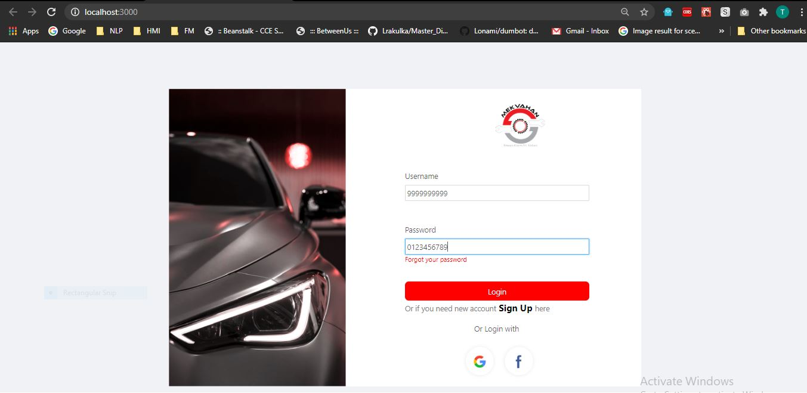
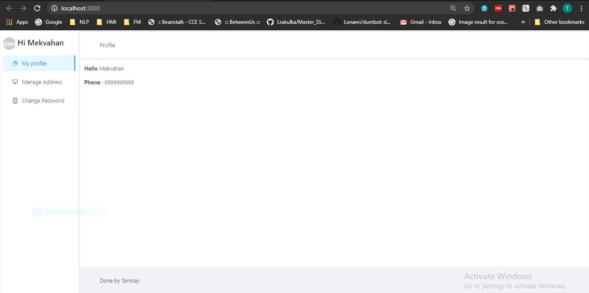
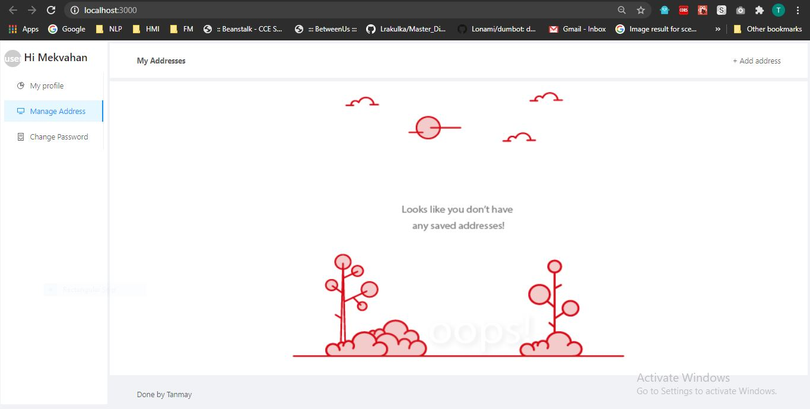
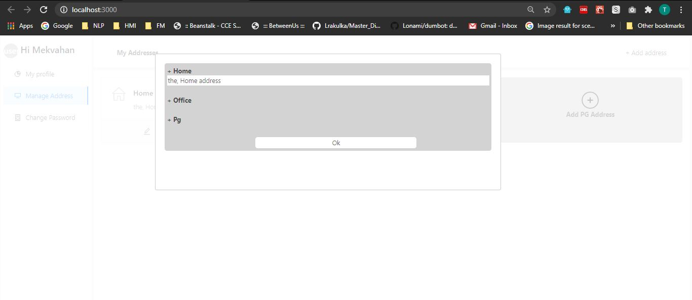
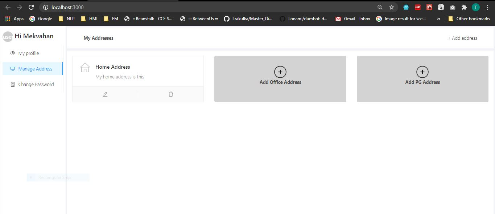
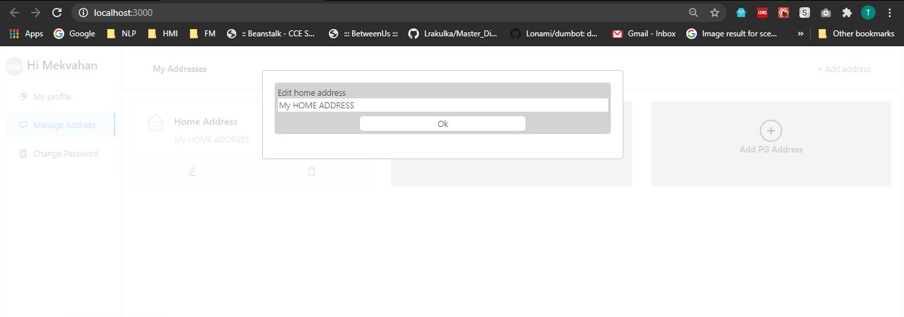
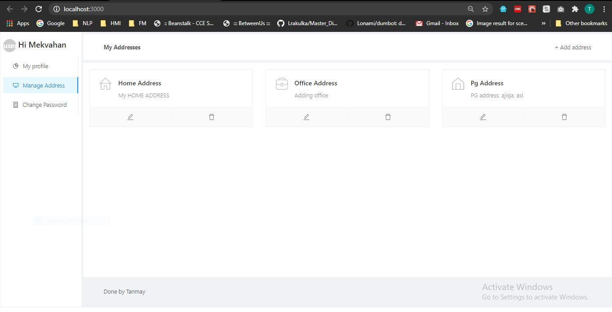

<h1>Mekvahan assignment</h1>

In order to run this project..download the repository

Do npm install in same directory

Run node api.js for backend server

And run npm start in other terminal

It will open in new tab at http://localhost:3000

  

  
Login page

  
                                                                    
Profile page
                                                                 
  
   
Home

  
   
Adding home addr

  
   
Home added

  
   
Edit home address

  
   
All addresses

  
 

